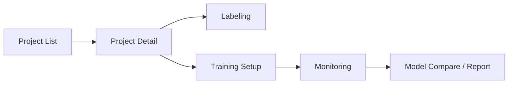

# YOLO Local Labeler Frontend

React frontend for object detection workflows:

- project management
- image labeling (BBox/OBB)
- training session setup and monitoring
- model comparison and reporting

## Screen Flow



## Tech Stack

- React 19 + TypeScript
- Vite (rolldown-vite)
- React Router
- Axios
- Recharts
- Konva

## Quick Start

### 1) Requirements

- Node.js 18+ (20+ recommended)
- npm 9+
- Running backend API (`http://localhost:8000`)

### 2) Install and Run

```powershell
cd detection_frontend\frontend\yolo-local-labeler
npm install
npm run dev
```

- URL: `http://localhost:5173`

## Environment Variables

Create `.env` in this folder:

```env
VITE_API_BASE_URL=http://localhost:8000
```

Base URL normalization rules:

- `http://localhost:8000` -> `http://localhost:8000/api/v1`
- `http://localhost:8000/api` -> `http://localhost:8000/api/v1`
- `http://localhost:8000/api/v1` -> unchanged

## Scripts

```bash
npm run dev
npm run build
npm run preview
npm run lint
```

## Route Map

| Path | Description |
|---|---|
| `/` | Project list |
| `/projects/:projectId` | Project detail |
| `/projects/:projectId/labeling` | Labeling screen |
| `/projects/:projectId/training` | Training setup and history |
| `/projects/:projectId/monitoring/:sessionId` | Training monitoring |
| `/compare` | Model comparison |
| `/report` | Report page |

## Backend Dependency

- REST: `http://localhost:8000/api/v1/*`
- WS: `ws://localhost:8000/api/v1/ws/training/{session_id}`

Start the backend before using training and monitoring pages.

